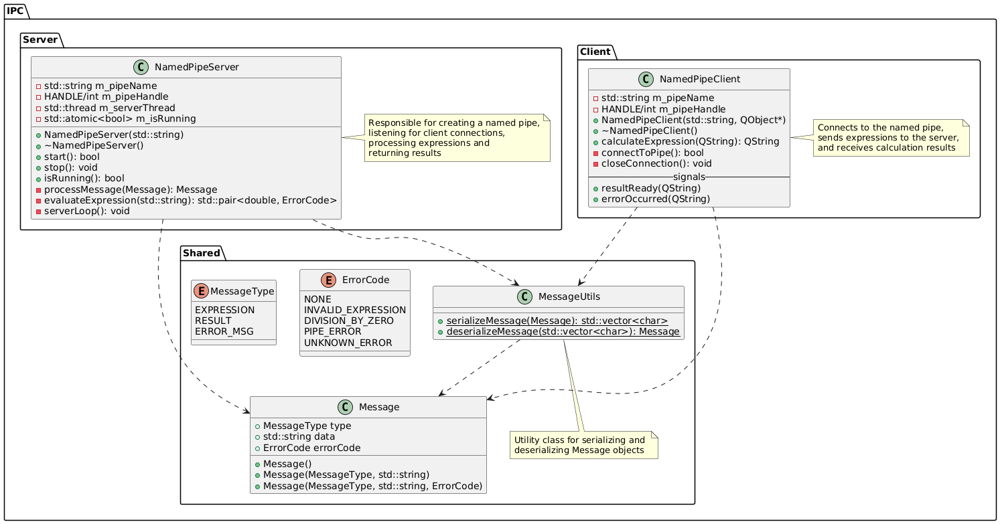
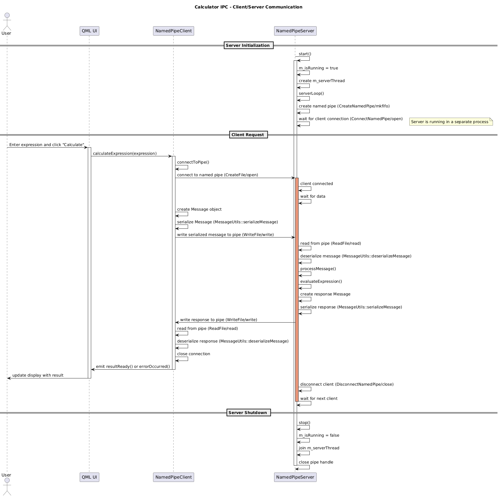

# Calculator Client-Server với Named Pipes

Dự án này là một ứng dụng máy tính đơn giản sử dụng kiến trúc client-server, trong đó client và server giao tiếp với nhau thông qua Named Pipes - một cơ chế IPC (Inter-Process Communication).

## Tổng quan

Ứng dụng gồm hai phần chính:
- **Server**: Xử lý các biểu thức toán học được gửi từ client
- **Client**: Giao diện người dùng được xây dựng với Qt Quick, cho phép nhập biểu thức và hiển thị kết quả

## Class Diagram



## Sequence Diagram



## Công nghệ sử dụng

- C++17
- Qt 6 (Qt Quick)
- CMake
- Named Pipes (Windows/UNIX)

## Cấu trúc dự án

```
Calculator_NamedPipe/
│
├── shared/              # Chứa code dùng chung giữa client và server
│   ├── Message.h        # Định nghĩa cấu trúc thông điệp
│   ├── MessageUtils.h   # Công cụ xử lý thông điệp
│   └── CMakeLists.txt   # CMake config cho thư viện shared
│
├── server/              # Code cho server
│   ├── main.cpp
│   ├── NamedPipeServer.h
│   ├── NamedPipeServer.cpp
│   └── CMakeLists.txt
│
├── client/              # Code cho client
│   ├── main.cpp
│   ├── NamedPipeClient.h
│   ├── NamedPipeClient.cpp
│   ├── qml/
│   │   └── main.qml     # Giao diện Qt Quick
│   ├── resources.qrc    # Qt Resource file
│   └── CMakeLists.txt
│
└── CMakeLists.txt       # CMake config chính
```

## Cách hoạt động

1. Server khởi động và tạo Named Pipe
2. Client kết nối đến Named Pipe
3. Client gửi biểu thức toán học đến server
4. Server tính toán biểu thức và trả về kết quả
5. Client hiển thị kết quả

## Cách biên dịch và chạy

### Yêu cầu
- CMake (3.14 trở lên)
- Trình biên dịch C++ hỗ trợ C++17
- Qt 6

### Biên dịch

```bash
mkdir build
cd build
cmake ..
cmake --build .
```

### Chạy

Cần chạy server trước, sau đó chạy client:

```bash
# Terminal 1
./server/calculator_server

# Terminal 2
./client/calculator_client
```

## Giao thức IPC

Giao thức truyền tin giữa client và server sử dụng cấu trúc Message được định nghĩa trong `shared/Message.h`:

- **MessageType**: Loại thông điệp (EXPRESSION, RESULT, ERROR_MSG)
- **ErrorCode**: Mã lỗi (NONE, INVALID_EXPRESSION, DIVISION_BY_ZERO, ...)
- **Data**: Dữ liệu thông điệp (biểu thức hoặc kết quả)

Format của thông điệp khi truyền qua Named Pipe:
```
[MessageType]|[ErrorCode]|[DataLength]|[Data]
```
